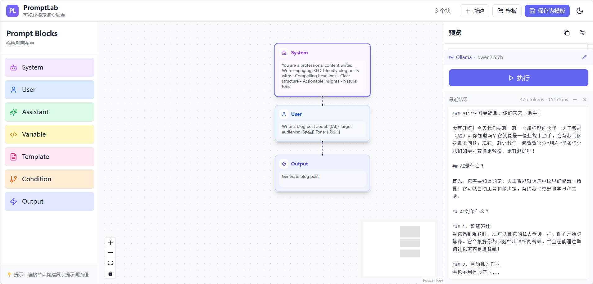
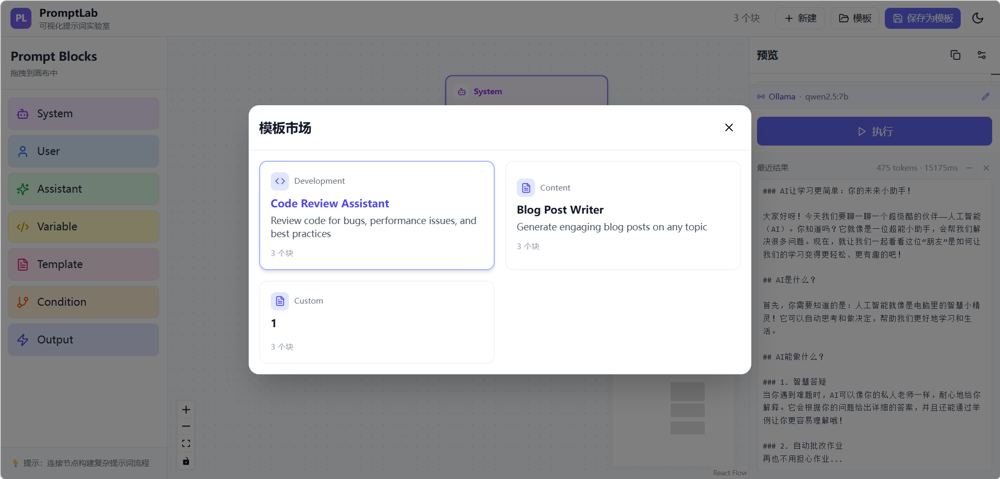
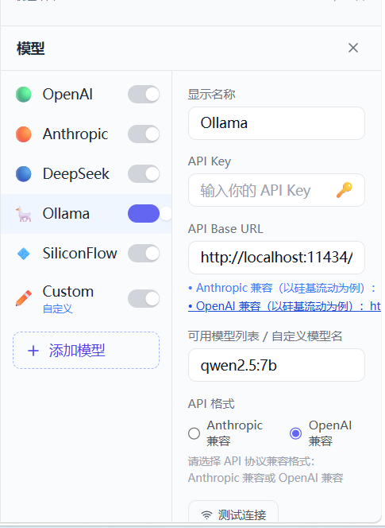

# 🧪 PromptLab

<p align="center">
  <strong>可视化提示词实验室 — 拖拽式 Prompt 工程工作台</strong>
</p>

<p align="center">
  
</p>

## ✨ 特性

- 🎨 **可视化画布** — 基于 ReactFlow 的拖拽式 Prompt 构建，所见即所得
- 📦 **模块化块系统** — System / User / Assistant / Variable / Template / Condition / Output 七种节点类型
- 🔗 **智能连线** — 块之间自动连接，数据流向一目了然
- 🤖 **多模型支持** — OpenAI、Anthropic、DeepSeek、Ollama、SiliconFlow 预设 + 自定义模型
- 🧪 **实时测试** — Monaco 编辑器编辑内容，一键执行查看结果
- 💾 **模板市场** — 内置模板一键加载，支持保存自定义模板
- ⚡ **本地优先** — Ollama 等本地模型零配置即可使用，无需 API Key
- 🔄 **热更新** — Vite HMR，修改即时生效

## 🖼️ 截图

### 主界面 — 画布 + 执行面板
<p align="center">
  
</p>

### 模板市场
<p align="center">
  
</p>

### 模型配置（支持 Ollama 本地模型）
<p align="center">
  
</p>

## 🚀 快速开始

```bash
# 克隆仓库
git clone https://github.com/PHclaw/promptlab.git
cd promptlab

# 安装依赖
npm install

# 启动开发服务器
npm run dev

# 构建生产版本
npm run build
```

打开 [http://localhost:3000](http://localhost:3000) 开始使用。

## 🛠️ 技术栈

| 技术 | 用途 |
|------|------|
| [React 18](https://react.dev) | UI 框架 |
| [TypeScript](https://www.typescriptlang.org/) | 类型安全 |
| [Vite 5](https://vitejs.dev/) | 构建工具 |
| [Tailwind CSS](https://tailwindcss.com/) | 样式 |
| [ReactFlow (@xyflow/react)](https://reactflow.dev/) | 画布与节点编排 |
| [Zustand](https://zustand.docs.pmnd.rs/) | 状态管理 |
| [Monaco Editor](https://microsoft.github.io/monaco-editor/) | 代码编辑器 |
| [Lucide React](https://lucide.dev/) | 图标 |

## 📐 项目结构

```
promptlab/
├── src/
│   ├── components/
│   │   ├── PromptBuilder/     # 画布核心组件
│   │   ├── PreviewPanel/      # 执行预览面板
│   │   └── Sidebar/           # 左侧块拖拽栏
│   ├── nodes/                 # 自定义 ReactFlow 节点
│   ├── stores/                # Zustand 状态管理
│   └── types/                 # TypeScript 类型定义
├── screenshots/               # 截图资源
├── public/                    # 静态资源
└── index.html
```

## 🎯 使用流程

1. **从左侧拖拽块**到画布（System → User → Output）
2. **点击块**用 Monaco 编辑器编写内容，支持 `{{变量}}` 占位符
3. **配置模型**：右侧面板选择预设或添加自定义 API
4. **点击「执行」**：Prompt 拼装后发送到选中的 LLM
5. **保存为模板**：满意的结果存入模板市场，下次一键复用

## 📄 License

MIT © [PHclaw](https://github.com/PHclaw)
